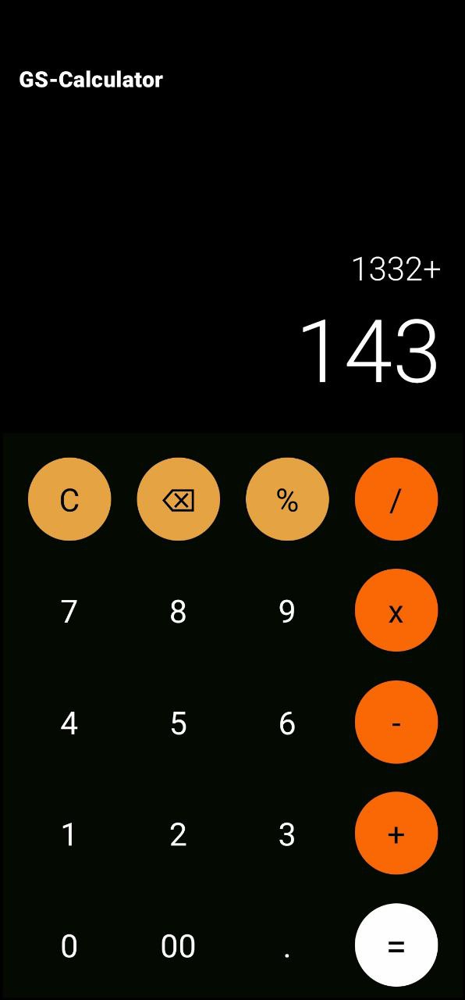

# Simple-calculator-app-Native

 A simple calculator app built using **React Native**, **Expo**, and **TypeScript**. The app allows basic operations like addition, subtraction, multiplication, division, and modulus.

## Features

- Simple and clean UI.
- Supports basic arithmetic operations: `+`, `-`, `*`, `/`, `%`.
- Clear and delete functionality.
- Responsive design for mobile screens.

  
## Installation

Clone the repository

Navigate to the project directory:
cd gs-calculator

Install dependencies and start the app:
-npm install
-npm start
-Open the Expo Go app on your mobile device and scan the QR code shown in the terminal or browser to run the app.

